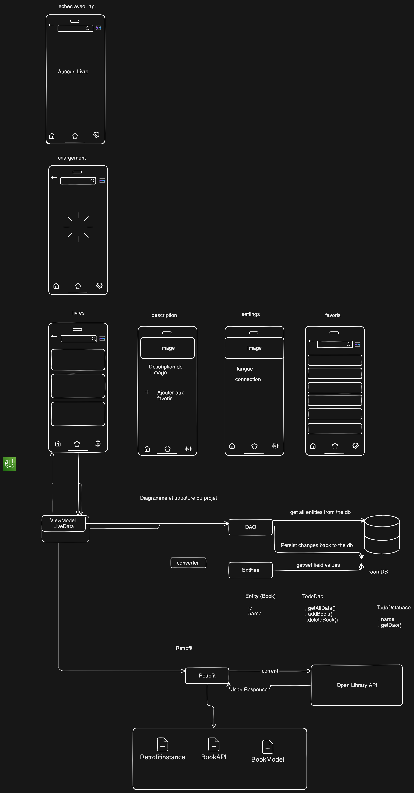

# OpenLib
A open Library App in kotlin jetpack compose 

# the structure of the project 

/src
└───/main
    └───/java
        └───/com
            └───/example
                └───/myapp
                    ├───/data           // Gestion des données (Room, Retrofit)
                    │   ├───/local      // Base de données locale (Room)
                    │   │   ├───BookDao.kt          // DAO de Room
                    │   │   ├───BookDatabase.kt     // La base de données Room
                    │   │   └───BookEntity.kt       // Entité Room (Livre)
                    │   ├───/remote     // Réseau et API (Retrofit)
                    │   │   ├───RetrofitInstance.kt // Singleton Retrofit
                    │   │   ├───BookApiService.kt   // Interface API Retrofit
                    │   │   └───BookModel.kt        // Modèles de données pour Retrofit
                    │   └───/repository // Logique d'accès aux données (Room et API)
                    │       └───BookRepository.kt   // Fusionne Room et Retrofit
                    ├───/ui             // Interface utilisateur (Jetpack Compose)
                    │   ├───/screens    // Les écrans principaux de l'application
                    │   │   ├───HomeScreen.kt       // Liste des livres (avec Scaffold)
                    │   │   ├───DetailsScreen.kt    // Détails du livre
                    │   │   ├───FavoritesScreen.kt  // Liste des favoris
                    │   └───/components // Composants réutilisables pour l'UI
                    │       ├───BookCard.kt         // Composant pour afficher un livre
                    │       ├───SearchBar.kt        // Barre de recherche
                    │       └───BottomNav.kt        // Barre de navigation inférieure
                    └───/viewmodel       // Gestion des états (Jetpack ViewModel)
                        └───BookViewModel.kt        // ViewModel pour gérer les données et UI

# presentation of the structure of the room , project and retrofit 
